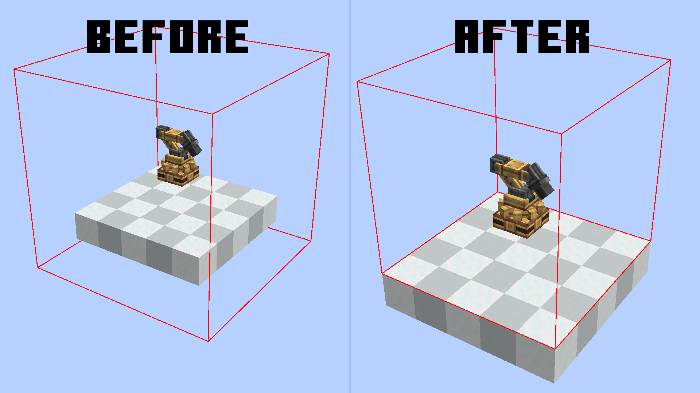
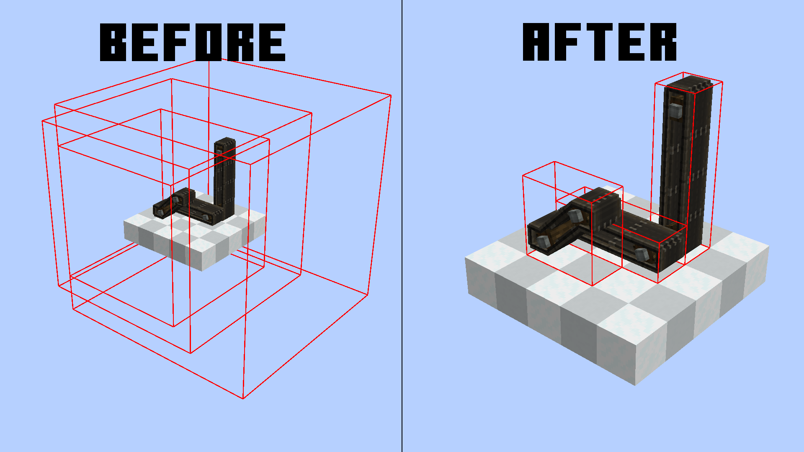
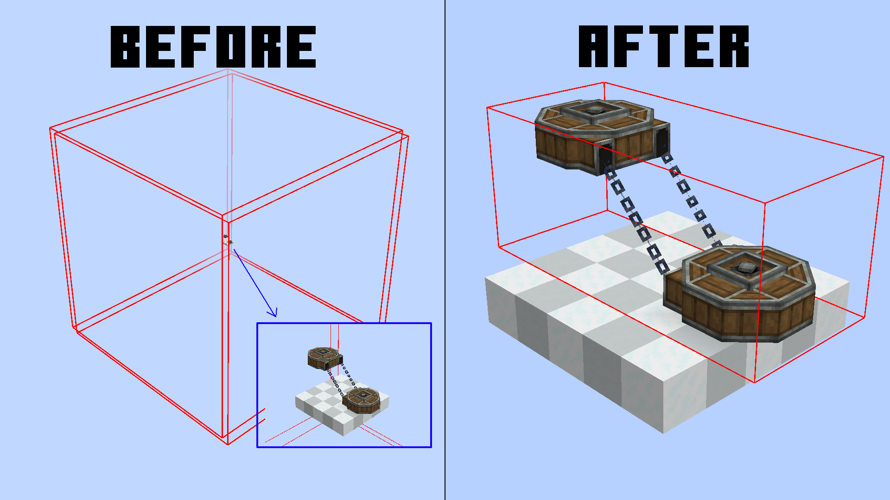
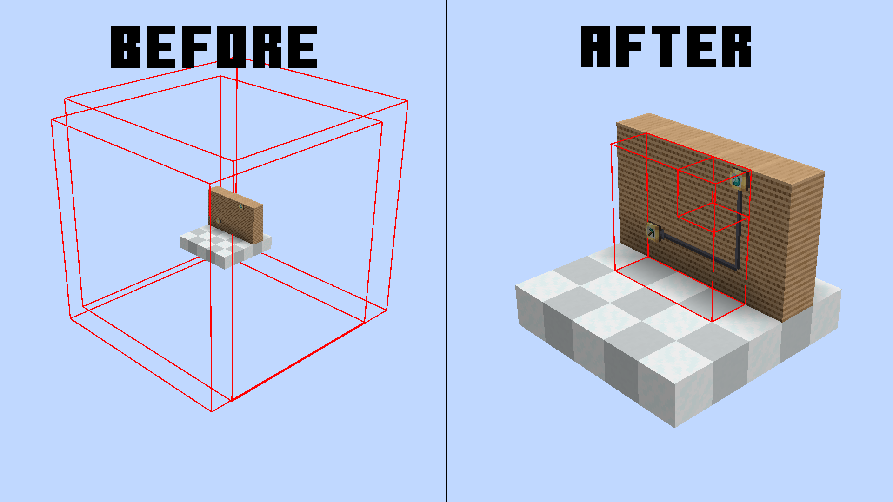
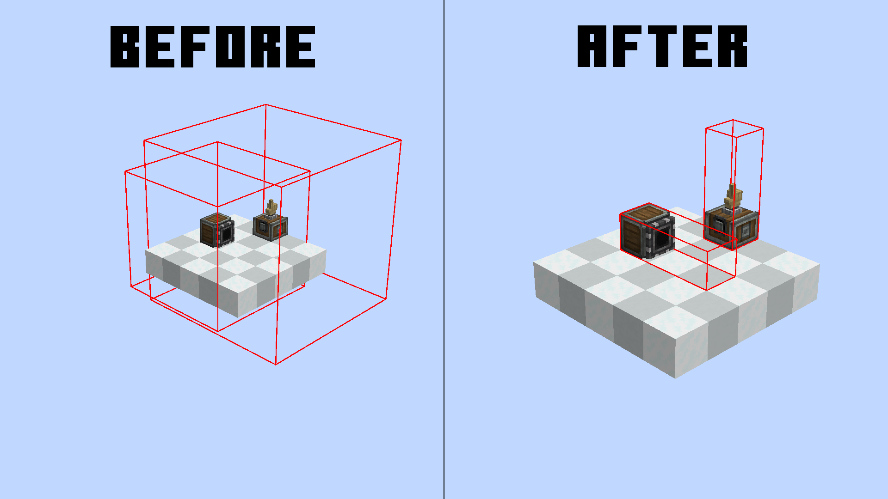
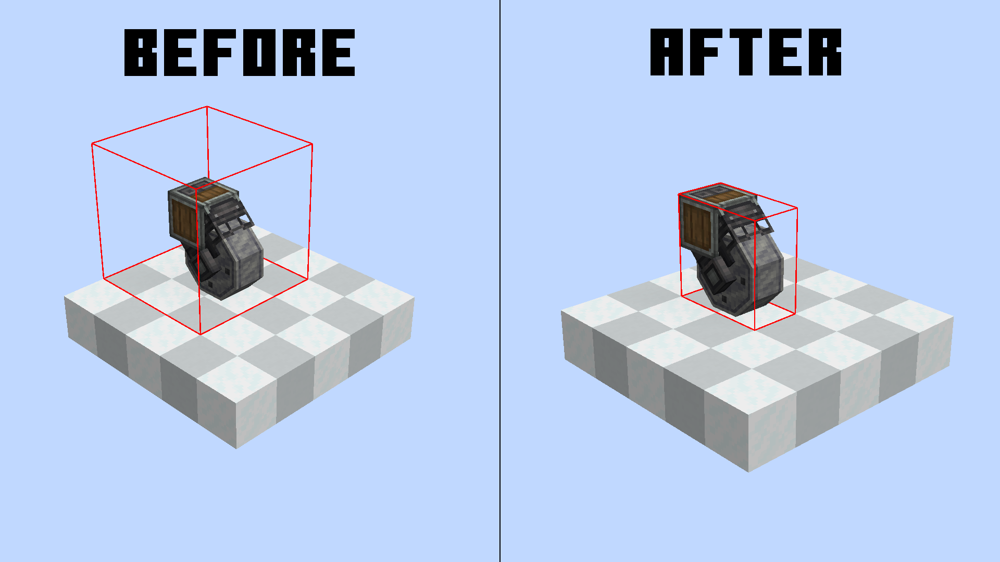

# Create: Smart Bounds

This mod aims to reduce enormous and nonsense [render bounds](#what-are-render-bounds) for create block entities.
You can check neoforge block entities render bounds with this command `/neoforge debug_blockentity_renderbounds true`

It also reworks some block entities render [bounds caching](#render-bounds-caching)

It's a pretty small optimization, but in large contraptions and big machine areas, it can make the difference.
We currently support:
- [Mechanical Arms](#mechanical-arms)
- [Belts](#belts)
- [Chain Conveyors](#chain-conveyors)
- [Factory Panels](#factory-panels)
- [PSI & Deployers](#psi--deployers)
- [Rollers](#rollers)
- [Frog Ports](#frog-ports)

## What are render bounds?
Usually, to optimize performance, all blocks that are behind/outside your screen are not rendered to avoid useless computations.
In blocks, this bound is set to a 3x3 area, but in block entities, this is customizable.
The reason? Simple, render things that are bigger than a block. For example, [Chain Conveyors](#chain-conveyors) need a larger render bounding box for chain connections.
The thing is, most times create goes by "better larger" and just inflates the whole area. This makes most of your block entities get rendered even though they are not even visible.

## Render Bounds Caching
The bounding box is not generated every frame, since the block only needs to change his bounding box on some precise events.
This mod also optimizes this, removing useless bounding box reloading for some blocks ([Belts](#belts)) which before reloaded their bounding box EVERY GAME TICK (20 times per second).
Now they only update if the block is broken and replaced, reducing the lag.

## Mechanical Arms
### Changes:
- Changed the bounding box to match all the arm max distances

## Belts
- Cache bounding box. They were updated EVERY TICK (not optimized)
- Changed the bounding box to match the precise direction and size

## Chain Conveyors
- Changed the bounding box to match the precise chain connections

## Factory Panels
- Update cached bounding box every time connections change
- Changed the bounding box to match the precise gauge connections

## PSI & Deployers
- Changed the bounding box to match the precise PSI/Deployer direction/Length

## Rollers
- Changed the bounding box to match the precise Roller shape

## Frog-Ports
- Frog ports are a little unique.
They do have a smart render bounding box, but if you break the chain conveyor, it just expands all the way to coordinate 0,0,0.
Pretty unique, huh?
I've seen in my worlds entire bounding boxes going all the way for thousands of blocks.